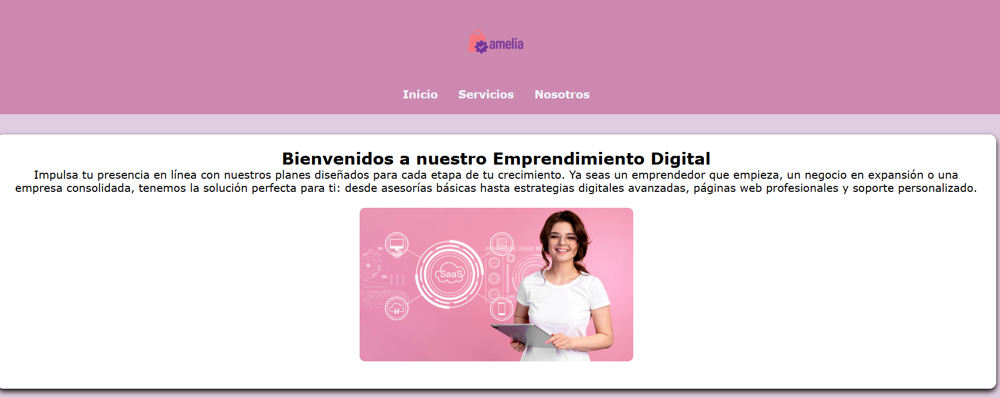
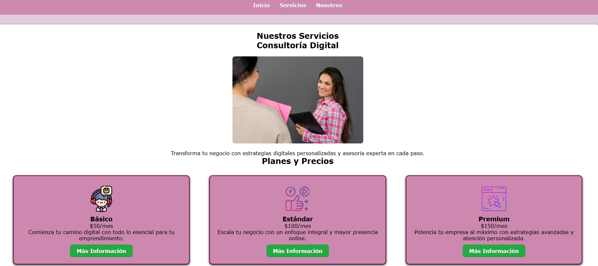

# Creación y Estilo de Páginas Web para Emprendedores

## Comenzando 🚀

Este taller práctico está diseñado para ayudarte a comprender y aplicar estilos CSS sobre una estructura básica construida con HTML. Es una introducción ideal para quienes están comenzando en el mundo del desarrollo web, ya que ofrece una base sólida con ejemplos reales, buenas prácticas y una visión clara sobre cómo transformar una página sencilla en un sitio visualmente atractivo y funcional.

### 🎯 Objetivo

Ampliar el sitio web realizado en el taller, incorporando nuevas páginas, botones funcionales, imágenes adicionales y aplicando estilos CSS personalizados.
Se busca que los estudiantes practiquen la organización de proyectos web profesionales, el versionamiento en Git, y la documentación clara.

#### Pre-requisitos 📋

- Un servidor web local o servicio de alojamiento  
- Navegador actualizado  
- Conocimientos básicos de HTML y CSS  

## Construido con 🛠️

* [Visual Studio Code](https://code.visualstudio.com/) - Editor de código fuente  
* [Git](https://git-scm.com/downloads/win) - Git Bash para Windows 

### Página principal

## Autores ✒️
* **Camila Segvia** - *Trabajo Inicial* - [camilu-code](https://github.com/villanuevand)

---
⌨️ con ❤️ por [Camila Segovia 😊].